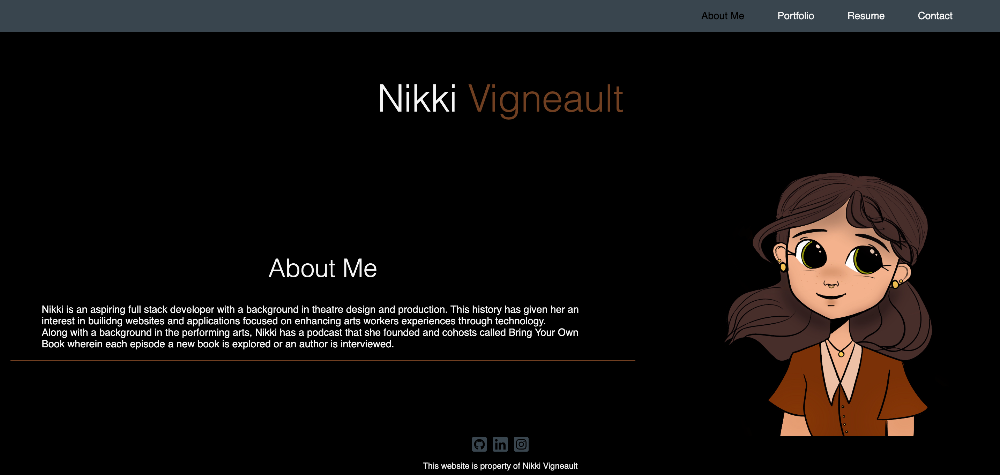
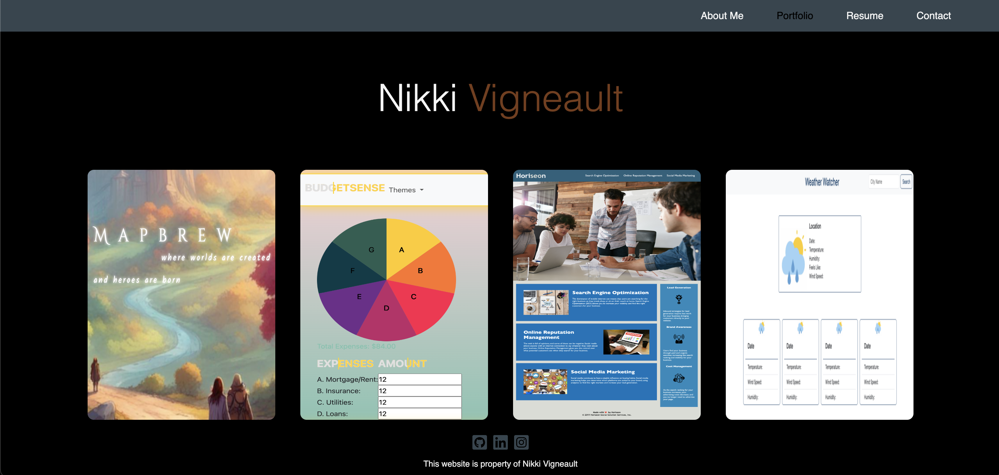
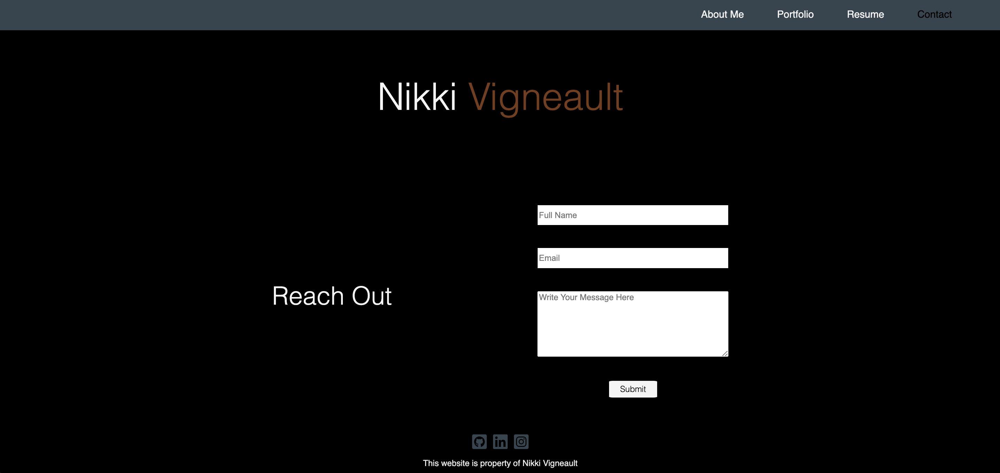

# Nikki Vigneault Coding Portfolio

## Description

This website is a demonstration of my work as a coder thusfar. In the website viewers will see a blurb about me, both in terms of coding and personally, as well as a portfolio of some of my work, a link to my resume and a contact page where soon, they will be able to send me messages from the site. 

## Future Features

In the near future some features I would like to incorporate are: 

- Backend set up for the contact form
- Stylized cohesive images for all of the projects in the portfolio
- A custom domain name

## Table of Contents
- [Examples](#examples)
- [Contributing](#contributing)
- [License](#license)
- [Questions](#questions)

## Examples 

## Contributing 

- Base stylization of code is my own and reused from my original portfolio (Challenge 2) and reworked to be used with React.

## License 
This project is licensed under the MIT License.

Permission is hereby granted, free of charge, to any person obtaining a copy of this software and associated documentation files (the “Software”), to deal in the Software without restriction, including without limitation the rights to use, copy, modify, merge, publish, distribute, sublicense, and/or sell copies of the Software, and to permit persons to whom the Software is furnished to do so, subject to the following conditions: 

The above copyright notice and this permission notice shall be included in all copies or substantial portions of the Software. 

THE SOFTWARE IS PROVIDED “AS IS”, WITHOUT WARRANTY OF ANY KIND, EXPRESS OR IMPLIED, INCLUDING BUT NOT LIMITED TO THE WARRANTIES OF MERCHANTABILITY, FITNESS FOR A PARTICULAR PURPOSE AND NONINFRINGEMENT. IN NO EVENT SHALL THE AUTHORS OR COPYRIGHT HOLDERS BE LIABLE FOR ANY CLAIM, DAMAGES OR OTHER LIABILITY, WHETHER IN AN ACTION OF CONTRACT, TORT OR OTHERWISE, ARISING FROM, OUT OF OR IN CONNECTION WITH THE SOFTWARE OR THE USE OR OTHER DEALINGS IN THE SOFTWARE.

https://choosealicense.com/licenses/mit/

## Questions 
Want to see more of my work? You can check out my Github profile by clicking my username below!

Github: [nikkivno](https://github.com/nikkivno) 

For any other questions or inquiries please feel free to reach out to my via email: nikkivigneault@gmail.com

